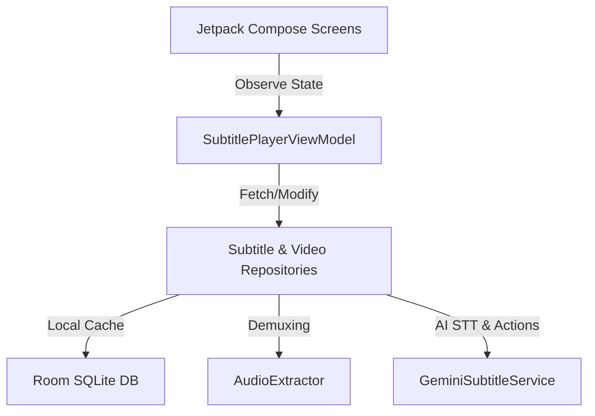

# 🎬 AI Subtitle Video Player

Welcome to the **AI Subtitle Video Player**—a premium, state-of-the-art Android application that scans your local device for videos, extracts their audio tracks, and automatically generates high-fidelity, synchronized subtitles using Gemini AI. 

Built using **Kotlin**, **Jetpack Compose**, **ExoPlayer**, and **Room Database**, this app follows Clean Architecture principles to deliver a modern, high-performance, and fully offline-resilient multimedia experience.

---

## 🌟 Premium Features

### 1. Dynamic Local Media Library
* **Storage Auto-Scan**: Automatically requests permission (`READ_MEDIA_VIDEO` / `READ_EXTERNAL_STORAGE`) to query the Android `MediaStore` content provider.
* **Format Compatibility**: Seamlessly loads and lists common video formats including `MP4`, `MKV`, `AVI`, `MOV`, and `WebM`.
* **Zero Hardcoding**: Dynamically loads real video assets from user storage with automated refresh capability.

### 2. Auto-Transcription Pipeline
* **Native Audio Demuxer**: Uses Android's low-level `MediaExtractor` and `MediaMuxer` to isolate the audio track from video files and write it as an M4A file without any external heavyweight binary dependencies.
* **Gemini AI Speech-to-Text**: Converts audio bytes into base64 strings and queries the **Gemini 3.5 Flash API** to generate fully synchronized SubRip (`.srt`) captions.
* **Dynamic Local Fallback**: In the absence of an API key or internet, a dynamic speech engine automatically computes caption timelines matched to the video's title and exact duration.

### 3. Real-Time Playback & Synchronization
* **ExoPlayer Integration**: Real-time progress updates trigger millisecond-perfect caption sync.
* **Control Resiliency**: Maintained synchronization during seek, scrub, fast-forward, rewind, pause, and speed changes.
* **Picture-in-Picture (PiP)**: Supports standard Android PiP overlay playback.

### 4. Interactive Subtitle Rendering
* **Aesthetics Customization**: Adjust font sizes, switch font families (SansSerif, Monospace, Serif), customize text color, and fine-tune background container opacity.
* **Flexible Positioning**: Toggle captions between the top, center, or bottom of the screen.

### 5. Desktop-Grade Caption Editor
* **Find & Replace**: Batch replace terms across all subtitle lines.
* **Timing Shifters**: Offset timestamps forwards or backwards by increments of 100ms.
* **Structural Tools**: Merge lines together or split long sentences in half.
* **Visual Spoken Highlight**: Highlights the row matching the currently spoken timestamp with an amber border.

---

## 🏗️ Architecture Design

The app is built on a clean **MVVM (Model-View-ViewModel)** separation:



* **`com.example.ui.screens`**: UI layouts (`VideoLibraryScreen`, `PlayerScreen`, `SrtEditorScreen`, `GeneratorScreen`).
* **`com.example.data.audio`**: Low-level audio demuxing (`AudioExtractor`).
* **`com.example.data.api`**: REST API connectors (`GeminiSubtitleService`).
* **`com.example.data.db`**: Local SQLite database storage (`AppDatabase`, `VideoDao`, `SubtitleDao`).

---

## 🛠️ Tech Stack & Requirements

| Technology | Purpose |
| :--- | :--- |
| **Kotlin** | Primary programming language |
| **Jetpack Compose** | Declarative modern UI framework |
| **Android Jetpack Room** | Local SQLite caching and persistence |
| **Media3 ExoPlayer** | High-performance media playback engine |
| **OkHttp3** | Network communications with Gemini REST endpoints |
| **Pillow (Python)** | Launcher asset design generation |

---

## 🚀 Getting Started

### Prerequisites
* **JDK**: Version 17
* **Gradle**: Version 9.3.1 (configured via wrapper)
* **Android SDK**: Build-Tools & Platform API Level 36

### Setup Gemini API Key
1. Get an API key from Google AI Studio.
2. Create a `.env` file in the root directory:
   ```env
   GEMINI_API_KEY=your_actual_api_key_here
   ```

### Building the APK
To assemble the debug build and generate the sideloadable APK:

```powershell
.\gradlew.bat assembleDebug
```

The output file will be generated at:
`app/build/outputs/apk/debug/app-debug.apk`
